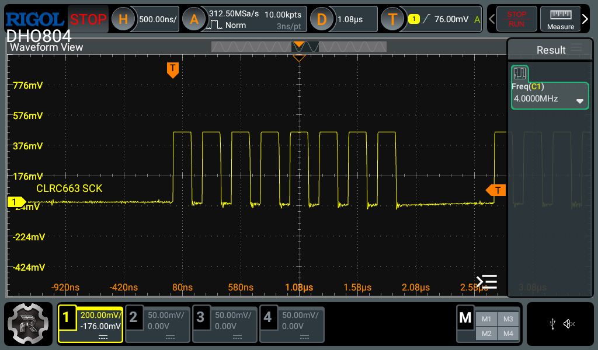

# CLRC663 configuration

The [CLRC663](https://www.nxp.com/products/CLRC66303HN) on the OM26630FDK is
connected via [SPI](https://en.wikipedia.org/wiki/Serial_Peripheral_Interface).

When idle, the SCK line remains low (CPOL = 0). Data is sampled on the rising
edge and shifted out on the falling edge (CPHA = 0). Do not use the
hardware-provided 4-wire SPI mode, as the CS line does not follow standard SPI
behavior in any configuration and must instead be manually controlled as a GPIO
pin.

The CLRC663 supports a maximum SCLK frequency of 10 MHz. NXP’s reference
firmware configures the SCLK at 4 MHz, which we have decided to follow as it
appears on this particular board 8 MHz is not stable, I have yet to figure out
why.

## Oscilloscope captures

All oscilloscope captures were taken on a [Rigol DHO804](https://www.rigolna.com/products/rigol-digital-oscilloscopes/dho800/),
utilizing the standard probes at x10. Ground springs were not used, so the
ringing and overshoot seen in the captures is likely to be a measurement setup
issue. Otherwise, the signals are clean and well-defined.

<figure>

<figcaption>Figure #1: CLRC663 SCLK rate (4MHz)</figcaption>
</figure>

